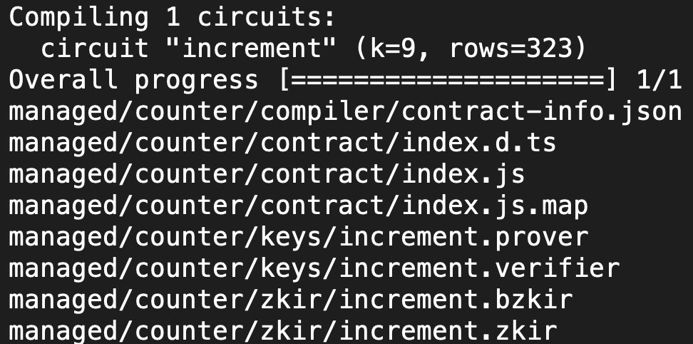
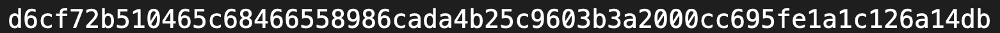

# Midnight Counter
> A Preprod counter whose public total advances by a disclosed increment, while Lace proves the caller knows a non-empty secret that never appears on screen.

## Live Demo
https://midnight-lvl2.vercel.app

Deploy again from this directory when the Vercel CLI is logged in:

```bash
npx vercel --yes
npx vercel --prod --yes
```

The first command creates a preview deployment. The second promotes the same project to production. Vercel should use Node.js 22. The build runs `npm run build`, which copies the circuit keys into `dist/keys` and `dist/zkir` before Vite emits the SPA. `vercel.json` rewrites unknown paths to `index.html` and leaves `/keys` and `/zkir` as static files.

Set `VITE_CONTRACT_ADDRESS` in the Vercel project to the Preprod contract address once that deploy exists, then run `npx vercel --prod --yes` again. Until then the page loads and tells you the address is unset.

## Contract Address
| Network | Address |
| --- | --- |
| Preview | d6cf72b510465c68466558986cada4b25c9603b3a2000cc695fe1a1c126a14db |
| Preprod | Deploy is waiting on faucet funding. Fund `mn_addr_preprod1kmgk06k37epdqudy7ea0n6ux9529r0sxnjtgplvznwav4gykcutq89hsgw` at https://midnight-tmnight-preprod.nethermind.dev and rerun the Preprod deploy below. |

The Preview row is the Level 1 counter, not the earlier hello-world scaffold (`d2a845490e973a0c5a6a798bf9c096c220ad30a6e89d412223bf127d61d5e3fc`). The Preprod wallet was created for this repository. Its recovery phrase is only in `mn-demo/.wallet-recovery-phrase.txt`, which is gitignored. Do not commit that file or `.midnight-state.json`.

After the contract deploys, put the address in `.env` as `VITE_CONTRACT_ADDRESS` (also gitignored) or export it before `npm run dev` / `npm run build`.

## What This Does
`contracts/counter.compact` stores a public `count` on the ledger. The `increment` circuit takes a private amount (`Uint<16>`) and a private witness, `userSecret` (`Bytes<32>`). It rejects an all-zero secret and a zero amount. On success it discloses only the increment and adds that amount to `count`.

The browser app connects to Lace on Preprod, proves `increment` through the wallet connector, and submits the balanced transaction. The disclosed amount is an input on the page. The secret is generated in memory for the witness and is never an input, never rendered, and never written into an on-screen log.

## Privacy Model
- PUBLIC: the ledger field `count`. After a successful call, anyone can read the new total. The increment is passed through `disclose()`, so that amount is published too.
- PRIVATE: the witness `userSecret`. Circuit arguments are private until disclosed, so `amount` is private inside the proof and public only after `disclose()`.
- What the user PROVES: that they know a 32-byte secret that is not all zeros, and that the increment is greater than zero. The secret is not written to the ledger and is not returned from the circuit.

## Privacy Claim
An on-chain observer sees the disclosed increment and the updated public `count`. They cannot see the secret the caller proved they know. The page states that split in the footer and keeps the witness off the DOM. The visible line `Proved without revealing your input` is that claim in the interface.

## Tech Stack
- Compact `>= 0.23` (compiler CLI `compact` 0.5.1)
- Midnight.js 4.1.1 (`@midnight-ntwrk/midnight-js-contracts`, indexer, fetch ZK config, network id) and `@midnight-ntwrk/dapp-connector-api` 4.0.1
- React, Vite, and TypeScript
- Lace wallet on Preprod, with proofs requested through the connector rather than a proof-server URL from the page
- Local proof server `midnightntwrk/proof-server:8.1.0` on port 6300, used by the deploy harness only

## Prerequisites
- Lace wallet in the browser, switched to Preprod
- Node.js v22 or newer
- Docker, only if you deploy or run the proof server: image `midnightntwrk/proof-server:8.1.0`
- The `compact` CLI on `PATH` if you recompile (`compact --version`)

## Run Locally
```bash
git clone https://github.com/guglxni/midnight-lvl2.git
cd midnight-lvl2
npm install
npm run dev
```

Open the URL Vite prints (http://localhost:5173). Connect Lace on Preprod, then increment. If `VITE_CONTRACT_ADDRESS` is empty, the button stays disabled until you set it and restart.

```bash
export VITE_CONTRACT_ADDRESS=<64-hex Preprod address>
npm run dev
```

Contract checks from the repository root:

```bash
npm test
npm run compile
```

`npm test` runs `tests/counter.test.ts` with Node's test runner: circuit logic, state transitions (`0 → 4 → 13`), and a check that the witness bytes stay out of the public transcript, ledger state, and disclosed outputs.

## Deploy the contract to Preprod
Install the harness once, then deploy. Do not run `docker compose down -v`. If port 6300 is already serving `midnightntwrk/proof-server:8.1.0`, leave that container running.

```bash
cd mn-demo
npm install
cd ..
docker run -d --name midnight-proof-server -p 6300:6300 midnightntwrk/proof-server:8.1.0
cd mn-demo
NODE_OPTIONS="--max-old-space-size=12288" npm run deploy -- --network preprod
```

A new wallet with a zero balance stops after printing the address and the faucet URL. Fund that address, then rerun the same deploy command. The seed is preserved in the gitignored state file.

## Demo Video
Placeholder: add the recording link here after you film the Lace connect and increment flow.

## Screenshots
Successful `compact compile` of `contracts/counter.compact`.



Preview deployment record for the Level 1 counter, `d6cf72b510465c68466558986cada4b25c9603b3a2000cc695fe1a1c126a14db`.


